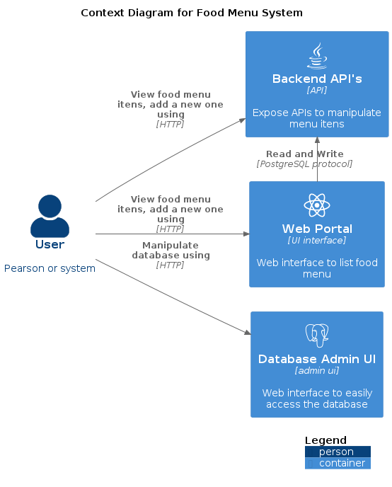
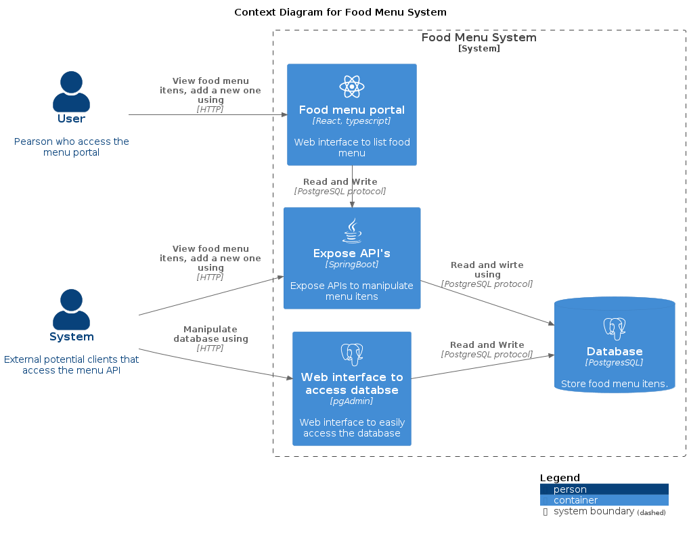
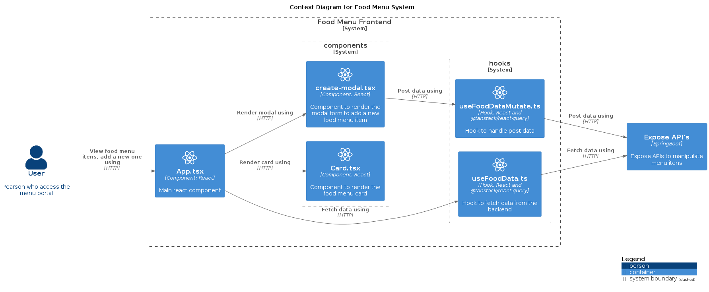
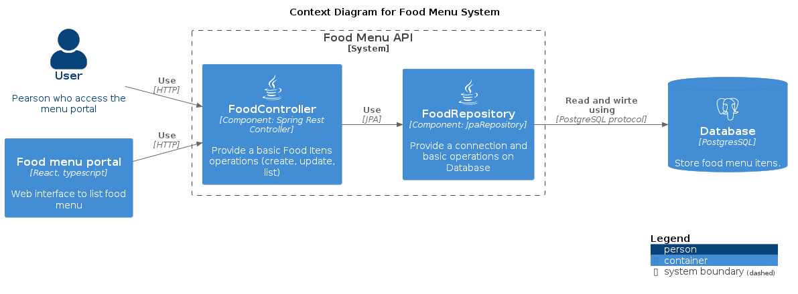
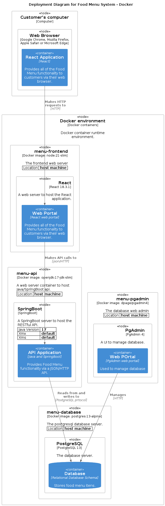

# Simple Food Menu - [Frontend] React, Typescript and [Backend] SpringBoot API

Simple Food menu project using React and Typescript for the front-end and SpringBoot for the backend, two separeted projects Dockerized.

### Context Diagram

You can see more detailed diagrams [here](#diagrams)




## 💻 Requirements

You should have [Docker](https://docs.docker.com/engine/install/) installed to run both projects and [vscode](https://code.visualstudio.com/) if you wanna try [DevContainer](https://code.visualstudio.com/docs/devcontainers/containers)

## 🚀 How to install

There is a docker-compose-yml file responsible to up two project (front-end and backend)

```bash
git clone <repo_URL>
docker compose up -d
```

## Note: 
For development environment or specific details see the README.md file in the sub-folders.

## Tech stack
#### Frontend
* React
* Typescript
* React Query
* Vite
* Axios

#### Backend
* Java 17
* SpringBoot
* Maven
* Postgres
* PgAdmin
* FlywayDB

#### Others
* Docker
* DevContainer
* [API Client Lite](https://marketplace.visualstudio.com/items?itemName=KomaKamaki.vscode-api-client-lite) - VSCode plugin

## Contact

Twitter: [@mcostacurta](https://x.com/costa_curta)

Linkedin: [@mcostacurta](https://www.linkedin.com/in/mcostacurta/)


## 📝 License

MIT

# Diagrams
Based on [c4model](https://c4model.com/)

## Context Diagram


## Container Diagram


## Component Diagram - Frontend



## Component Diagram - Backend



## Deployment Diagram



